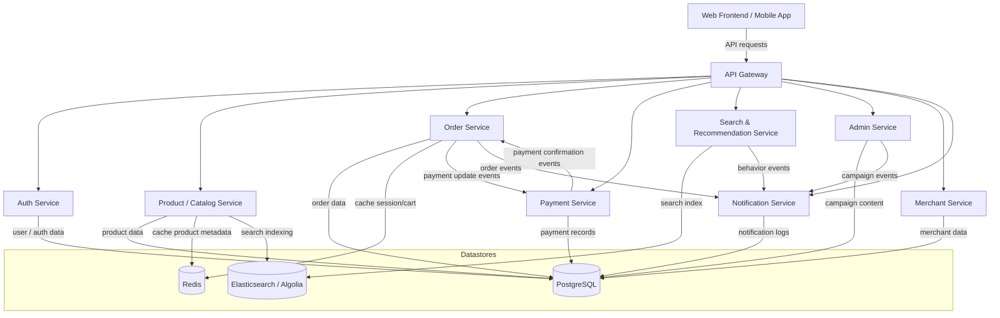

# Service Dependency Diagram

## Overview
Diagram ini menggambarkan dependensi utama antara frontend, API gateway, layanan backend, dan layanan pendukung untuk platform e-commerce fashion.

## Diagram Penjelasan
- `Web Frontend / Mobile App`: UI customer-facing. Semua permintaan melewati API Gateway.
- `API Gateway`: central routing, auth enforcement, dan rate limiting.
- `Auth Service`: mengelola login, register, dan user profile.
- `Product / Catalog Service`: menyajikan katalog produk, varian, dan metadata filtering.
- `Order Service`: lifecycle order, reservasi stok, fulfillment.
- `Payment Service`: integrasi gateway, pembayaran, dan webhook handling.
- `Search & Recommendation Service`: pencarian cepat, autocomplete, dan rekomendasi personal/basic.
- `Admin Service`: CMS, campaign, promo rule, dan admin workflows.
- `Merchant Service`: merchant inventory management dan order fulfillment updates.
- `Notification Service`: email / SMS / push notifications.
- `PostgreSQL`: relational datastore untuk user, order, auth, content, admin.
- `Redis`: cache session, cart state, dan filter cache.
- `Elasticsearch / Algolia`: search engine untuk query dan autocomplete.
